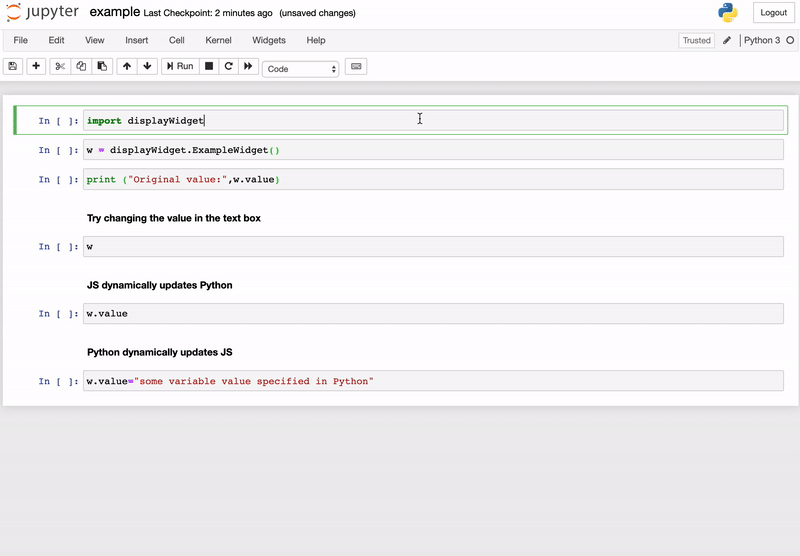

# jupyter-widget-react-ts-webpack
Jupyter Widget (ipywidget) written in React (with JSX), Typescript, compiled with webpack.

This is an example Jupyter Widget that uses React and is written in Typescript.
The template is largely based off of [widget-ts-cookiecutter](https://github.com/jupyter-widgets/widget-ts-cookiecutter) and [this](https://github.com/jupyter-widgets/ipywidgets/issues/2207#issuecomment-422957803) ipywidget issue. 

The main files that differ from `widget-ts-cookiecutter` is  `src/widget.tsx`, `package.json`, `tsconfig.json`, and `webpack.config.js`.

To get the widget installed, run: 
`sh install.sh`

The widget demonstrates a basic text box input field that dynamically updates based on the Python variable state. This is done via `view.listenTo` in `widget.tsx` that is triggered whenever the object state is changed. In addition, the widget demonstrates how the input field can be propogated to the Python variable state. This is done via `view.model.set` and `view.model.save_changes` (This should ideally be done via `view.touch`.). The basic demo can be found in the `example.ipynb` notebook.

